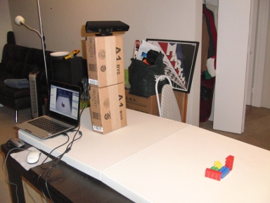
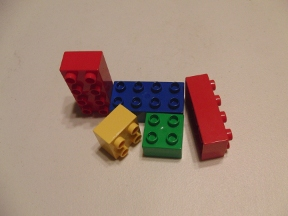

kinect-duplo-sensing
====================

ROS package for identifying Duplo blocks with the Microsoft Kinect sensor

Developed in Fall 2011 for the Sensing & Planning in Robotics (CSCI 545) course at USC.

Used ROS and the PR2-simulator to obtain point cloud data from a robot-head-mounted Microsoft Kinect sensor.  Segmented Duplo blocks by color and size to identify block orientation and perform robotic manipulation tasks.

# Demo
Real-time Duplo recognition using a Kinect sensor and the PointCloud Library.

## Setup

## Duplo Test Arrangement

## Video
<video width="320" height="240" controls>
	<source src="images/duplo_kinect_demo.mpeg" type="video/mpeg">
</video>

